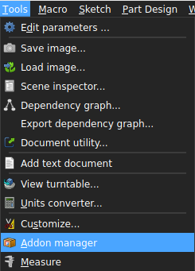
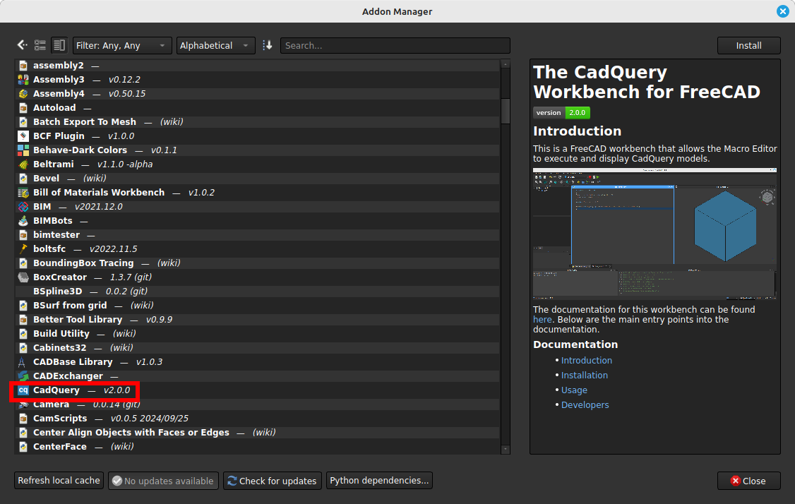
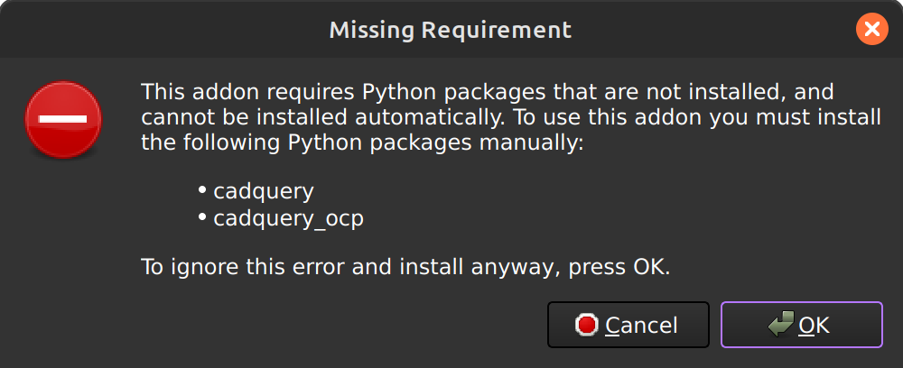

[<Back to Main](index.md) | [Usage>](usage.md)
## Installation

### Table of Contents
- [Automated (via the Addon manager)](installation.md#automated)
- [Manual](installation.md#manual)

### Automated (via the Addon manager)

This workbench can be install via FreeCAD's `Addon manager`.
1. Run the FreeCAD Addon Manager by clicking `Tools->Addon manager`

2. Scroll down and click on `CadQuery`

3. Click the `Install / update` button
3. Restart FreeCAD
4. Confirm that CadQuery is in the drop down menu of available workbenches

This process can be repeated to update the module every time changes are pushed to the master branch on GitHub.

### Manual
Sometimes a different version or branch of the workbench may be needed, other than what is installed using the addon manager. The steps below outline the steps to manually install the workbench.
1. Download the [latest released version](https://github.com/CadQuery/cadquery-freecad-workbench/releases)
2. Extract the archive file
3. Copy the entire extracted directory to FreeCAD's `Mod` directory on your system. Typical `Mod` directory locations are listed below.

**Linux Mod Locations**
- /usr/lib/freecad/Mod
- /usr/local/lib/freecad/Mod
- ~/.FreeCAD/Mod
- ~/.local/share/FreeCAD/Mod

**Windows Mod Locations**
- C:\Program Files\FreeCAD 0.14\Mod
- C:\Program Files (x86)\FreeCAD 0.14\Mod
- C:\Users\[your_user_name]\Application Data\FreeCAD\Mod

**Mac Mod Locations**
- /Applications/FreeCAD.app/Contents/Mod
- /Applications/FreeCAD.app/Mod
- /Users/[your_user_name]/Library/Preferences/FreeCAD/Mod
- ~/Library/Preferences/FreeCAD/Mod

## Troubleshooting Dependencies

Sometimes the dependencies of the workbench will not install automatically. You may be an error similar to the following.

If this happens, go ahead and click the `OK` button. Please check the list below to make sure that your system is supported by CadQuery's dependency chain by checking the following list.

* Linux Intel/AMD
* Windows Intel/AMD
* MacOS Intel
* MacOS ARM64

Once you have checked that list, restart FreeCAD, and try the backup installation method shown below.

### Install CadQuery Stable

Activate the `CadQuery` workbench from the dropdown. This should add a `CadQuery` item to FreeCAD's menu. Click on the menu item, and expand the `Install` submenu. There you will find a `Install CadQuery Stable` item.

Click that and check the Report View to see when it is finished installing. It will take a few minutes. Once the installation is complete, restart FreeCAD.

You can also re-run this menu item again to update the CadQuery dependencies after a workbench update.

There are other installation options in this submenu, but they are made available for testing purposes.

[<Back to Main](index.md) | [Usage>](usage.md)
